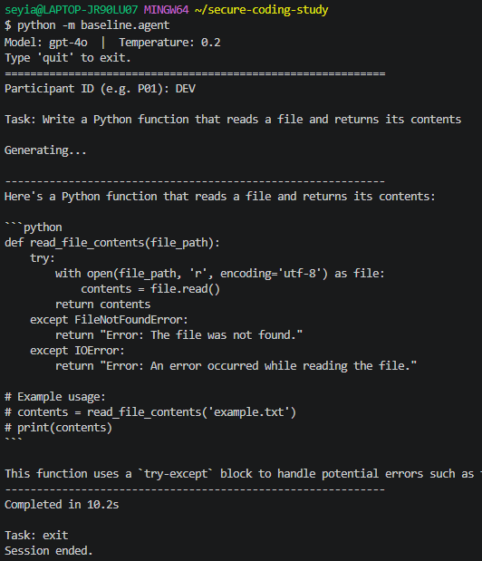
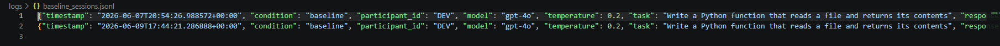

# Baseline Coding Agent

**MSc Research Project · University of Exeter · COMM514**


A single-agent AI coding assistant built with Python and the OpenAI API. This is the control condition for a controlled experiment comparing simple single-agent AI against a structured multi-agent system for secure code generation. You submit a coding task, GPT-4o returns working code, and the session is logged for analysis.

---

## Architecture


The flow is linear:

```
Developer types task
       |
Terminal CLI (baseline/agent.py)
       |
run_baseline() -- single GPT-4o call, temp 0.2
       |
Code response printed to terminal
       |
Session logged to JSONL
```

No branching. No agents talking to each other. No tools. No vector databases. Just a developer, a prompt, and GPT-4o.

---

## See it in action



The agent takes a plain-English coding task, calls GPT-4o, and prints the result directly in the terminal. No delays, no intermediate steps, no review loops.

---

## Simple by design

This agent is intentionally minimal. That is not a limitation, it is the point.

In a controlled experiment, one condition has to be the baseline. Adding security prompting, multi-step review, or tool integrations to this agent would corrupt the comparison. The whole research question is whether a more structured architecture produces more secure code than a basic one-shot approach. If both conditions have the same capabilities, there is nothing to compare.

So this agent does exactly one thing: take a task, call GPT-4o, return the code.

Everything else comes in the multi-agent system built next.

---

## How it works


The core logic is three functions:

- **`run_baseline(task)`** sends a single system prompt and the user's task to GPT-4o, then returns the response. One API call. No iteration.
- **`log_session()`** appends a timestamped JSON record to `logs/baseline_sessions.jsonl` after every session.
- **`main()`** is the terminal interface. It loops, accepts tasks, and exits cleanly on `quit`.

The system prompt is kept minimal on purpose. No security instructions. No structured output format. No guidance beyond "write working, readable code." That is the baseline.

---

## Session logging

Every session produces a structured log record:



```json
{
  "timestamp": "2026-06-07T20:54:26.988572+00:00",
  "condition": "baseline",
  "participant_id": "DEV",
  "model": "gpt-4o",
  "temperature": 0.2,
  "task": "Write a Python function that reads a file and returns its contents",
  "response": "...",
  "duration_seconds": 8.407
}
```

The schema is identical across both conditions in the experiment (baseline and multi-agent), which makes statistical comparison straightforward. The only field that differs is `condition`.

---

## Tech stack

| Layer | Technology |
|---|---|
| Language | Python 3.11 |
| LLM | GPT-4o via OpenAI API |
| API client | OpenAI Python SDK (direct, no LangChain) |
| Logging | JSONL |
| Config | python-dotenv |

---

## Running it yourself

**1. Clone the repo and install dependencies**

```bash
git clone https://github.com/seyiabello/gpt4o-coding-agent.git
cd gpt4o-coding-agent
pip install openai python-dotenv
```

**2. Add your OpenAI API key**

Create a `.env` file in the project root:

```
OPENAI_API_KEY=your-key-here
```

**3. Start the agent**

```bash
python -m baseline.agent
```

**4. Submit a task**

```
Participant ID (e.g. P01): DEV

Task: Write a Python function that parses a JSON file and returns a dict
```

Type `quit` to end the session.

---

## Running the tests

```bash
python -m unittest tests.test_baseline -v
```

8 unit tests cover the core functions with no real API calls.

---

## What comes next

This agent is the starting point. The next build is a five-agent system where a human participant works alongside a team of specialised AI agents:

1. **Planner** breaks the task into steps and defines scope
2. **Threat Modeller** identifies security risks and maps them to the CWE Top 25
3. **Code Generator** writes code informed by the plan and threat model
4. **Code Reviewer** runs static analysis via Bandit and critiques the output
5. **Verifier** validates the final code against the original threat model

That system adds RAG over a CWE corpus (ChromaDB), MCP tool integrations (Bandit, NIST NVD, sandboxed execution), and a LangGraph orchestration layer. The human participant approves, revises, or overrides at each stage.

The experiment will measure whether that structured approach reduces vulnerability density compared to this baseline.

---

## Research context

This project is part of an MSc dissertation at the University of Exeter (COMM514). It is a controlled experiment, not a production tool. Participants are computer science and software engineering students. All sessions are anonymised. Ethics approval is in progress via Worktribe.

> Supervisor confirmed: complexity is justified if it improves output quality. The goal is to build something outstanding.