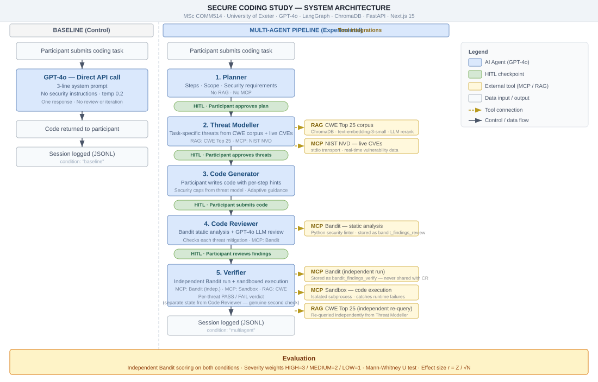
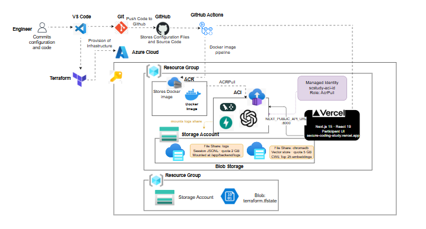

# Secure Coding Study

**MSc Research Project · University of Exeter · COMM514**


Does adding structure, specialised roles, and real security tooling to an AI pipeline produce measurably fewer vulnerabilities than a single model doing everything at once?

This project builds both sides of that question as a controlled experiment.

**Live deployment**

| | URL |
|---|---|
| Frontend (Vercel) | https://secure-coding-study.vercel.app |
| Backend API (Fly.io) | https://secure-coding-study-api.fly.dev |
| API docs | https://secure-coding-study-api.fly.dev/docs |

---

## What was built

Two conditions, one experiment.

**Baseline** gives a participant a coding task and sends it straight to GPT-4o with a three-sentence, security-free prompt. One API call, one response, nothing else. This is the control group.

**Multi-agent** routes the same task through a five-agent LangGraph pipeline. A Planner breaks the task into steps, a Threat Modeller pulls real CWEs from a RAG corpus and live CVEs from NIST NVD, the participant writes the code themselves with structured per-step hints that are security-capped, a Code Reviewer runs Bandit static analysis plus an LLM review against the threat model, and a Verifier does a fully independent second pass with sandboxed code execution. The participant approves or adjusts the output at each stage before the next agent runs.

After the experiment, an independent Bandit run scores every submission from both conditions. A Mann-Whitney U test then compares the vulnerability distributions.

---

## Architecture

The proposal showed a hub-and-spoke diagram. The implementation is different: a linear sequential pipeline with human-in-the-loop (HITL) checkpoints at each stage. The human is not an external orchestrator controlling agents in parallel. They are a participant embedded inside the pipeline, approving one stage at a time.



### Platform and DevOps architecture



The platform architecture covers the full deployment stack: source control and CI/CD via GitHub Actions, containerised backend on Azure Container Instances pulling from Azure Container Registry with a user-assigned managed identity, persistent file shares for logs and the ChromaDB vector store, Terraform remote state in a bootstrap storage account, and the Next.js frontend deployed on Vercel.

The baseline is a single GPT-4o call sitting outside this pipeline: a three-line, security-free prompt, one response, nothing else.

---

## Key design decisions

**Why is temperature 0.2 everywhere and set in one shared file?**
The experiment measures architecture, not randomness. Consistent temperature means any difference in output quality comes from the pipeline design. One shared `config.py` makes it impossible for a single agent to silently use a different setting.

**Why is the baseline prompt deliberately minimal with no security instructions?**
Scientific validity. Adding security guidance to the baseline would artificially close the gap. The research question only makes sense if the two conditions differ only in their architecture, not their instructions.

**Why LangGraph instead of a simpler approach?**
LangGraph handles shared state across five async agents and the pause-and-resume pattern for HITL checkpoints without custom plumbing. The tradeoff is a steeper learning curve, but the alternative was building a bespoke async state machine that would have added complexity with no research value.

**Why are Bandit runs kept independent between Code Reviewer and Verifier?**
The Verifier is a genuine second check, not a repeat. If both agents shared Bandit results, the two checks would be correlated and the combined verdict would be less meaningful. Separate state fields (`bandit_findings_review` and `bandit_findings_verify`) enforce this at the data level.

**Why Mann-Whitney U rather than a t-test?**
Vulnerability counts from small samples (around 26 per condition) are unlikely to be normally distributed. Mann-Whitney is the appropriate non-parametric test for this kind of ordinal, small-sample comparison.

---

## Project structure

```
secure-coding-study/
├── backend/
│   ├── main.py                   FastAPI entry point
│   ├── config.py                 Shared OpenAI client, MODEL, TEMPERATURE
│   ├── models.py                 Pydantic request/response schemas
│   ├── routes/                   API route handlers
│   ├── mcp_client.py             MultiServerMCPClient wrapper
│   ├── baseline/                 Single-agent baseline (control condition)
│   │   ├── agent.py
│   │   ├── prompts.py
│   │   └── README.md
│   ├── multiagent/               Five-agent LangGraph pipeline
│   │   ├── graph.py              Pipeline wiring and HITL checkpoints
│   │   ├── state.py              Shared AgentState TypedDicts
│   │   ├── step_classifier.py    Per-step hint cap assignment via GPT-4o
│   │   └── agents/
│   │       ├── planner.py
│   │       ├── threat_modeller.py
│   │       ├── code_generator.py
│   │       ├── code_reviewer.py
│   │       └── verifier.py
│   ├── rag/                      ChromaDB vector store and retrieval pipeline
│   ├── mcp_servers/              Bandit, NIST NVD, and Sandbox MCP servers
│   └── evaluation/               Bandit scoring and statistical analysis
├── frontend/                     Next.js 16 participant interface
│   └── app/
│       ├── page.tsx              Landing page
│       └── study/
│           ├── baseline/         Baseline condition UI
│           └── multiagent/       Multi-agent condition UI
├── tests/                        pytest suite, 21 tests, no real API calls
└── logs/                         JSONL session logs (gitignored)
```

---

## Tech stack

| Layer | Technology | Why it was chosen |
|---|---|---|
| LLM | GPT-4o | Strongest available reasoning for security analysis |
| Orchestration | LangGraph | Native HITL checkpointing with shared state across agents |
| Vector store | ChromaDB | Fast local search, no external database dependency |
| Embeddings | `text-embedding-3-small` | Efficient and accurate for short CWE descriptions |
| RAG reranking | GPT-4o | LLM-as-judge selects top 3 from 10 retrieved chunks |
| Static analysis | Bandit via MCP | Industry-standard Python security linter, run twice independently |
| Threat intelligence | NIST NVD via MCP | Live CVE data to ground threat modelling in real vulnerabilities |
| Sandboxed execution | Custom MCP server | Safe code execution for the Verifier without host system risk |
| Backend API | FastAPI + uvicorn | Async, type-safe, OpenAPI documentation built in |
| Frontend | Next.js 16, React 19, TypeScript | Production-grade participant interface with Monaco Editor |
| Statistics | scipy | Mann-Whitney U, Wilcoxon signed-rank, Kruskal-Wallis |

---

## Running locally

### Prerequisites

- Python 3.11 or higher
- Node.js 20 or higher
- An OpenAI API key with GPT-4o access

### Backend

```bash
# From the project root
python -m venv venv
venv\Scripts\activate          # Windows
# source venv/bin/activate     # Mac / Linux

pip install -r requirements.txt

cp .env.example .env
# Edit .env and add your OPENAI_API_KEY

cd backend
uvicorn main:app --reload --port 8000
```

### Ingest the CWE corpus (run once before the first session)

```bash
# From backend/
python -m rag.ingest
```

### Frontend

```bash
cd frontend
npm install
npm run dev
# Open http://localhost:3000
```

### Tests

```bash
# From the project root (PowerShell)
$env:PYTHONPATH = "backend"
python -m pytest tests/ -v
```

---

## Evaluation

After data collection, run the analysis from the project root:

```bash
$env:PYTHONPATH = "backend"
python -m evaluation.stats
```

This loads both JSONL log files, runs an independent Bandit pass over every submission, computes three scores per session (vulnerability count, severity-weighted score using HIGH=3/MEDIUM=2/LOW=1, and high-severity count), and outputs the Mann-Whitney U result with effect size r = Z / sqrt(N).

---

## Agent READMEs

Each agent has its own README covering what it does, how it fits in the pipeline, and the key design decisions behind it.

- [Baseline (control condition)](backend/baseline/README.md)
- [Planner](backend/multiagent/agents/README_planner.md)
- [Threat Modeller](backend/multiagent/agents/README_threat_modeller.md)
- [Code Generator](backend/multiagent/agents/README_code_generator.md)
- [Code Reviewer](backend/multiagent/agents/README_code_reviewer.md)
- [Verifier](backend/multiagent/agents/README_verifier.md)

---

## Research context

MSc Cybersecurity dissertation, University of Exeter (COMM514). Target sample: approximately 56 participants split evenly across both conditions. Primary outcome measure: high-severity Bandit finding count per submission. Secondary analyses control for task order effects (Wilcoxon signed-rank) and task difficulty as a confound (Kruskal-Wallis).
