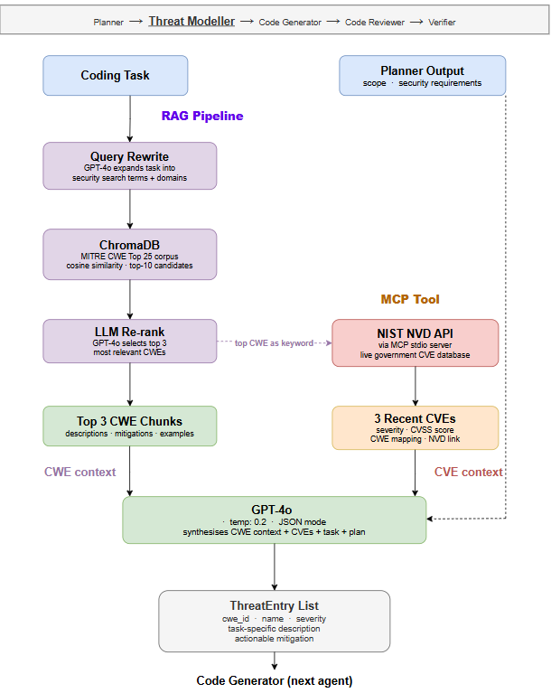
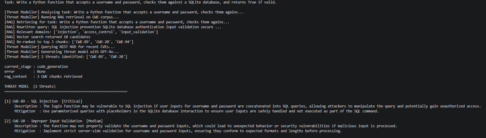
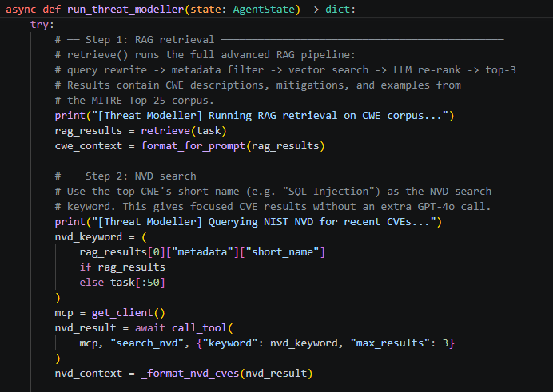

# Threat Modeller Agent


Second agent in the pipeline. Takes the Planner's output and produces a task-specific threat model grounded in real security data. The threats it identifies are passed forward to every subsequent agent as the security contract for the whole session.

---

## Architecture



```
Planner output (steps + security_requirements)
               |
    run_threat_modeller(state)
               |
       +--------------+
       |              |
   RAG query      MCP call
  CWE Top 25   NIST NVD API
  ChromaDB      Live CVEs
  top-3 chunks  for task domain
       |              |
       +--------------+
               |
          GPT-4o synthesis
          temp 0.2, JSON mode
               |
       ThreatEntry list
   cwe_id, name, severity
   description, mitigation
               |
       HITL checkpoint
   Participant reviews threats
   Adds or removes entries
               |
   Code Generator (stage 3)
```

---

## What it produces

A list of `ThreatEntry` objects, one per identified threat:

```json
{
  "cwe_id": "CWE-89",
  "name": "SQL Injection",
  "severity": "Critical",
  "description": "The login function concatenates user input directly into the SQL query, allowing an attacker to bypass authentication.",
  "mitigation": "Use a parameterised query with a ? placeholder. Never interpolate user input into SQL strings."
}
```

Critically, the `mitigation` field is task-specific and implementable. Not "use secure queries" but "use a parameterised query with a ? placeholder." That level of specificity is what lets the Code Reviewer and Verifier make a concrete pass/fail judgement later.

---

## Two data sources

**RAG over CWE Top 25:** The retrieval pipeline rewrites the query into security search terms, filters ChromaDB by relevant CWE domains, retrieves the top 10 chunks by cosine similarity, and then uses a GPT-4o re-rank call to select the top 3 most relevant. This five-step pipeline reduces noise compared to a raw similarity search.

**NIST NVD via MCP:** A live CVE lookup grounded in real vulnerabilities that match the task domain. This gives the threat model current, real-world evidence rather than just theoretical categories.

GPT-4o then synthesises both sources into task-specific threats. The RAG context and the live CVEs are stored in state separately so they can be inspected for research purposes.

---

## See it running





---

## Key design decisions

**Why RAG instead of just prompting GPT-4o with "think about security"?** RAG grounds the output in real CWE data. Without it, GPT-4o tends to produce the same generic threats regardless of task. The retrieval step forces the model to engage with the actual documented weaknesses relevant to this specific coding problem.

**Why keep RAG context and live CVEs separate in state?** Transparency and reproducibility. The raw retrieval results are logged alongside the final threats so the research can verify what data the model was working from when it produced each threat.

**Why does the participant get to edit threats?** HITL approval here is not just a formality. If the Threat Modeller misses a relevant threat or produces an irrelevant one, the participant can correct it. Their corrections become part of the experiment data, which adds a human judgement layer that the baseline never has.

---

## Running standalone

```bash
# From the project root
python -m multiagent.agents.threat_modeller --test
```

---

## Where it fits

| Stage | Agent | Tools |
|---|---|---|
| 1 | Planner | None |
| 2 | **Threat Modeller** (this agent) | RAG (ChromaDB), NIST NVD via MCP |
| 3 | Code Generator | HITL hints |
| 4 | Code Reviewer | Bandit via MCP |
| 5 | Verifier | Bandit + Sandbox via MCP, RAG |
